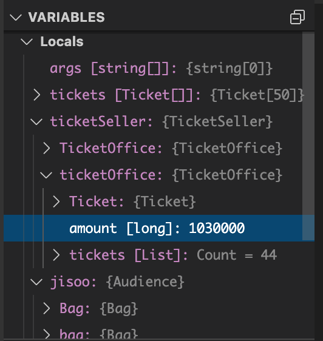

# Chapter 01

Test theater program

## Overview

책에는 class 설계 중심으로 설명되어 있고 실제 실행하면 어떤 결과가 나오는지에 대한 내용은 없다.\
Theater class들의 조합으로 실행 프로그램을 만들 생각이 없었는지는 모르겠지만
어쨌든 class를 설계한대로 객체를 생성하고 객체간 연결 관계를 만들어서 실행하는 프로그램을 만들어 본다.\
특이한 점은 클래스에 get method를 제공하지 않았기 때문에
프로그램 상에서 값의 변화에 대한 걸 직접 확인해 볼 수 없다는 것이다.\
따라서 디버거를 붙여서 마지막에 객체들의 상태가 어떻게 변화됐는지 확인해야 한다.

> 물론 get method를 추가해서 tickets의 count나 bag의 amount를 출력해 볼 수 있으나 그건 나중에 리팩토링 하면서 추가해 본다.

## Build and Run

- Chapter01/Object_Design/Theater 경로로 이동한 뒤에 `dotnet run`을 입력한다.
- 실행해도 결과는 "Theater example!"만 나온다. 직접 디버깅해서 객체의 상태를 살펴봐야 한다.
- 자세히 디버깅하는 방법은 아래 문서를 참고한다.
- https://docs.microsoft.com/ko-kr/dotnet/core/tutorials/debugging-with-visual-studio-code

``` bash
$ cd Chapter01/Object_Design/Theater
$ dotnet run
```


## Code review

- Ticket, TicketSeller, TicketOffice는 서로 밀접한 관계를 가지고 있다.
- 실제 프로그램으로 만들었을 때는 ticket 50장에 100만원이 있다고 가정한다.

``` csharp
// Create tickets and ready to set up theater with ticket office, ticket seller
Ticket[] tickets = new Ticket[50];
for (int i = 0; i < 50; i++)
{
    tickets[i] = new Ticket();
}
TicketSeller ticketSeller = new TicketSeller(new TicketOffice(1000000, tickets));
```

- Bag을 가지고 있는 Audience를 생성한다. 5개 정도 생성해서 3개는 Invitation이 없는 Bag, 2개는 Invitation이 있는 Bag으로 생성한다.

``` csharp
Audience jisoo = new Audience(new Bag(20000));
Audience rose = new Audience(new Bag(30000));
Audience lisa = new Audience(new Bag(60000));
Audience jennie = new Audience(new Bag(new Invitation(), 30));
Audience feel = new Audience(new Bag(new Invitation(), 40));
```

- Theater를 생성하고 TicketSeller를 배치한 뒤에 Audience 다섯명을 입장시킨다.
- Enter 메소드 안에서는 초대장을 확인하고 Bag에서 Ticket.fee 만큼의 amount를 빼고, TicketOffice에 amount를 추가하게 된다.

``` csharp
Theater1 theater = new Theater1(ticketSeller);
theater.Enter(jisoo);
theater.Enter(rose);
theater.Enter(lisa);
theater.Enter(jennie);
theater.Enter(feel);
```

- 객체들의 상태 값들을 출력해 보고 싶지만 어쨌든 잘못된 설계를 시작한 것으로 가정 한 것이므로 이대로 둔다.
- 디버깅 했을 때 스크린샷인데, Invitation이 없는 jisoo, rose, lisa는 ticket.fee를 지불했으므로 TicketOffice에는 1030000이 나오는게 정상이다.
- jisoo, rose, lisa 각 객체의 bag을 보면 초기에 설정한 값보다 10000씩 적게 나오는 것 역시 확인 가능하다.
- 

